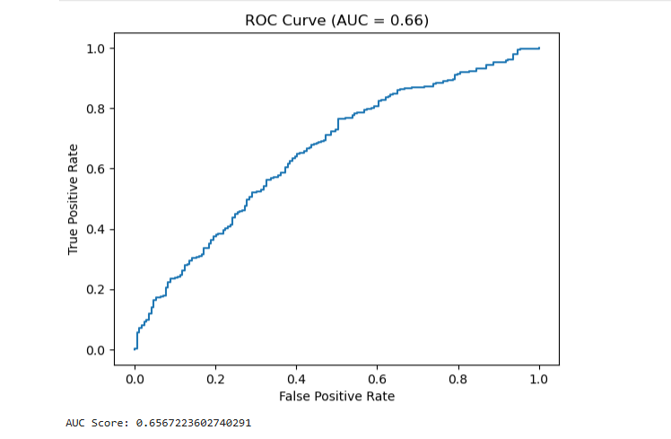

# 🤖 Customer Churn Prediction

**Domain:** Customer Analytics | Machine Learning

**Tools:** Python • Pandas • NumPy • Scikit-learn • Matplotlib • Jupyter Notebook

Predicting customer churn using machine learning to help businesses identify at-risk customers and improve customer retention strategies.

---

# 📸 Project Preview




---

## 📂 Dataset

The dataset used in this project is publicly available.

**Source:** Hospital Billing Dataset (Kaggle)

🔗 https://www.kaggle.com/datasets/...

> Note: The dataset is not included in this repository due to its size. Please download it from the source above and place it in the `data/` folder before running the analysis.


# 📖 Project Overview

Customer churn is one of the biggest challenges for subscription-based and service-oriented businesses. Losing existing customers is often more expensive than acquiring new ones.

This project applies machine learning techniques to predict whether a customer is likely to churn based on customer demographics, account information, and service usage.

The goal is to help organizations identify high-risk customers early and implement proactive retention strategies.

---

# 🎯 Business Problem

Businesses need to answer questions such as:

- Which customers are most likely to churn?
- What factors influence customer churn?
- Can churn be predicted before it happens?
- How can businesses improve customer retention?
- Which customer segments require immediate intervention?

---

# ❓ Business Questions

- What percentage of customers are likely to churn?
- Which customer attributes contribute most to churn?
- Does contract type influence customer retention?
- Are monthly charges associated with higher churn?
- Which customer segment has the highest churn rate?
- How accurately can machine learning predict churn?

---

# 📊 Dataset Description

The dataset contains customer information, including:

- Customer demographics
- Account information
- Contract type
- Monthly charges
- Total charges
- Tenure
- Internet service
- Payment method
- Customer churn status

**Target Variable**

- Churn (Yes / No)

---

# 🧹 Data Preparation

The dataset was prepared using Python.

Data preprocessing included:

- Handling missing values
- Removing duplicates
- Data cleaning
- Encoding categorical variables
- Feature selection
- Feature scaling
- Train/Test split

---

# 🤖 Machine Learning Workflow

The project followed a complete machine learning pipeline:

1. Data Collection
2. Data Cleaning
3. Exploratory Data Analysis
4. Feature Engineering
5. Data Preprocessing
6. Model Training
7. Model Evaluation
8. Prediction
9. Business Recommendations

---

# 🧠 Models Used

- Logistic Regression
- Random Forest Classifier

---

# 📈 Model Evaluation

Performance was evaluated using:

- Accuracy
- Precision
- Recall
- F1 Score
- ROC-AUC
- Confusion Matrix

---

# 📊 Model Performance

| Metric | Logistic Regression | Random Forest |
|---------|--------------------:|--------------:|
| Accuracy | *(0.72)* | *(Add your result)* |
| Precision | *(0.70 )* | *(Add your result)* |
| Recall | *(0.45 )* | *(Add your result)* |
| F1 Score | *( 0.44 )* | *(Add your result)* |
| ROC-AUC | *( 0.5927)* | *(Add your result)* |

---

# 📊 Visualizations

The project includes:

- Churn Distribution
- Correlation Heatmap
- Feature Importance
- Confusion Matrix
- ROC Curve
- Precision-Recall Curve

---

# 💡 Key Insights

Example insights (replace with your actual findings):

- Customers on month-to-month contracts were more likely to churn.
- Higher monthly charges were associated with increased churn.
- Customers with shorter tenure had a greater risk of leaving.
- Contract type was one of the strongest predictors of churn.
- The Random Forest model performed slightly better than Logistic Regression in identifying churn patterns.

---

# ✅ Recommendations

Based on the analysis:

- Focus retention campaigns on customers with short tenure.
- Encourage customers to switch from month-to-month to longer-term contracts.
- Offer loyalty incentives for high-risk customer segments.
- Monitor customers with high monthly charges.
- Use predictive models to identify customers who may churn before cancellation.

---

# 🛠 Skills Demonstrated

- Machine Learning
- Predictive Analytics
- Customer Analytics
- Python Programming
- Pandas
- NumPy
- Scikit-learn
- Data Cleaning
- Feature Engineering
- Feature Scaling
- Exploratory Data Analysis (EDA)
- Model Evaluation
- Classification Algorithms
- Data Visualization
- Business Intelligence
- Data Storytelling

---

# 📂 Repository Structure

```
Customer-Churn-Prediction
│
├── data
│   └── customer_churn.csv
│
├── notebooks
│   └── Customer_Churn_Prediction.ipynb
│
├── models
│   ├── logistic_regression.pkl
│   └── random_forest.pkl
│
├── Images
│   ├── model-overview.png
│   ├── confusion-matrix 01.png
│   ├── roc-curve.png
│   └── feature-importance.png
│
├── requirements.txt
├── LICENSE
└── README.md
```

---

# 🚀 Outcome

This project demonstrates how machine learning can be used to predict customer churn, identify key drivers of customer attrition, and support data-driven retention strategies. The workflow combines data preprocessing, predictive modeling, evaluation, and business recommendations to solve a real-world customer analytics problem.

---

# 👩‍💻 Author

**Anita Okechukwu**

Healthcare Professional • Data Analyst • Business Intelligence • Aspiring AI Specialist

📧 **anitaokechukwu927@gmail.com**

---

⭐ If you found this project helpful, feel free to **star this repository**.
